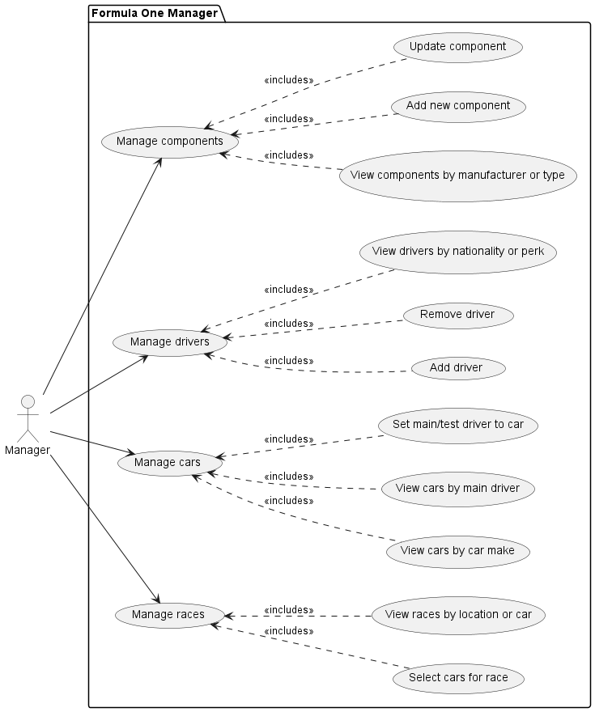
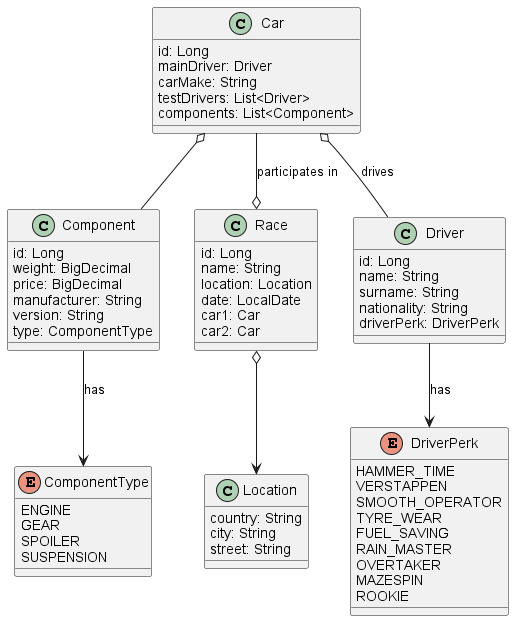

## Project description

A Formula 1 team is in need to manage its participation to the world championship.
The team has two cars participating to each race, each one driven by one driver,
with other test drivers available to develop the car further.
The manager of the team can set the driver for each car and manage a list of other (test) drivers
that are under contract and he can also set as main drivers if unhappy about results.
Each driver has a name, surname, nationality, and perk (e.g. overtaker, rain master, etc..)
that the manager can visualize. The car is composed of several components (engine, suspensions),
that the different departments of the team (e.g. engine, aerodynamics) evolve during time.
The manager can pick from a list of components and assemble the cars that will participate to the next race.
Engineers from other departments can login to the system and put newer components available.
The manager can view those components and they can be used to improve the car.

### The project is divided into 4 modules

- Race: This module is responsible for managing races.
- Driver: This module is responsible for managing drivers.
- Component: This module is responsible for managing components.
- Car: This module is responsible for managing cars.

You can find the models of each module in the diagrams below.

## How to run the project:

### Each module has its own port:

| Port | Service   |
|------|-----------|
| 8081 | Race      |
| 8082 | Driver    |
| 8083 | Component |
| 8084 | Car       |

### Pre-requisites:

- Docker
- Docker-compose
- Java 21
- Maven

### To run whole project:

In the root folder of the project run the following commands in
the terminal or command prompt.

```shell
docker-compose up --build
```

### To access the services:

You can access the services through the following links:

http://localhost:8081/swagger-ui/index.html - Race

http://localhost:8082/swagger-ui/index.html - Driver

http://localhost:8083/swagger-ui/index.html - Component

http://localhost:8084/swagger-ui/index.html - Car

### To seed the database:

If you haven't already, create a virtual environment and install requests

```bash
python3 -m venv .venv
source .venv/bin/activate
pip install requests
```

- To seed database, you need to have running application
- Then enter database directory and run `python seed.py`
- To clear the database, you can run `python clear.py`

### To stop the project:

```shell
docker-compose down
```

### To run one module in project:

```shell
mvn spring-boot:run
```

## Diagrams

### Use case diagram



### Class diagram



## Runnable Scenario

This scenario simulates a Formula 1 team manager's interaction with a comprehensive management system, allowing the
user <br>
to perform a wide range of operations on drivers, components, cars, and races. The scenario is designed to showcase <br>
how our application can support complex operations and manage high loads, especially during peak usage times.

### Goals

The primary goal is to demonstrate:

1. **Realistic Simulation**: The ability to emulate real-world usage by a Formula 1 team manager, ensuring <br>
   the application is practical in day-to-day operations.
2. **Efficiency and Speed**: How quickly the system can handle requests under simulated peak conditions.
3. **Robustness and Error Handling**: The application's capability to gracefully handle errors, such as attempting <br>
   to create or assign non-existent entities or modifying deleted entities.

### Features Demonstrated

The scenario covers the following functionalities:

- **Creating and Managing Drivers**: Add drivers, assign them to cars, and manage them based on specific attributes <br>
  like nationality or special skills (e.g., performance in rain).
- **Component Management**: Create and categorize components like engines and gears, update them, or delete unnecessary
  components.
- **Car Assembly and Management**: Assemble cars from components, assign drivers, and manage car details.
- **Race Management**: Create races, assign cars to races, and manage race details based on location and participation.
- **Dynamic Filtering and Retrieval**: Retrieve drivers, cars, and races based on specific filters such as make,
  location, or driver attributes.

### Scenario Execution

If you haven't already, create a virtual environment and install locust

```bash
python3 -m venv .venv
source .venv/bin/activate
pip install locust
```

#### 1. Run all modules

```bash
docker-compose up
```

#### 2. Run script

```bash
locust -f showcase.py --host http://localhost:8081
```

#### 3. Open in web browser

```bash
http://localhost:8089/
```

Adjust ``Number of users`` and ``Spawn rate`` to test different scenarios. <br>
*Note: !Do not change Host!*

### Expected Results

Upon running this scenario, you should observe:

- **Performance Metrics**: Response times, request success/failure rates, and system throughput.
- **System Behavior Under Load**: How the system handles increased load, simulating real-world peak usage scenarios.
- **Error Handling**: Responses to erroneous operations, ensuring the system provides meaningful error messages and
  codes.

## Collecting and displaying Metrics

To collect the metrics from the services we use Prometheus,
Grafana is used for displaying them.

Both services are running automatically in docker container together with other modules,
when you run the docker-compose.<br>
You can check prometheus UI at http://localhost:9090.<br>
You can see grafana at http://localhost:3000

### Grafana setup

Credentials to log into Grafana are:

- user - `admin`
- password - `admin`

Some basic dashboards have been created automatically, but feel free to experiment and see different metrics.

# Security

All the services are now secured. To use them, retrieve a bearer token using the service http://localhost:8080/. Then
open swagger UI of each service and authorize with the token. 
